# App journey map

A visual map of what the app does today, and which file does each part. It's meant for debugging. All paths are relative to `anonyverse/src/`. The backend contract is in [api.md](api.md).

- [1. Mind map](#1-mind-map)
- [2. User journey](#2-user-journey)
- [3. Who does what](#3-who-does-what)
- [4. Auth and session](#4-auth-and-session)
- [5. Matchmaking loop (`findMatch`)](#5-matchmaking-loop-findmatch)
- [6. Finding Match states](#6-finding-match-states)
- [7. Chat states](#7-chat-states)
- [8. Server event → handler](#8-server-event--handler)
- [9. Debugging cheat sheet](#9-debugging-cheat-sheet)

---

## 1. Mind map

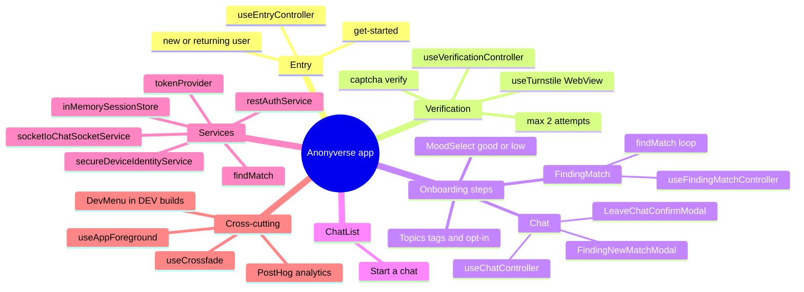

---

## 2. User journey

Solid boxes are real stack routes. Dashed boxes are **steps rendered in place** inside a route, crossfaded by `useCrossfade` rather than pushed.

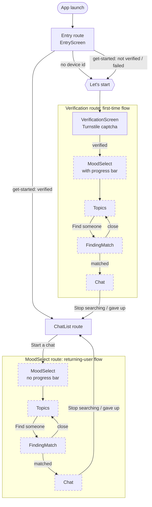

> From any FindingMatch or Chat step: if the session can't be refreshed, `navigation.reset` sends the user back to **Entry**.

Where it lives: `navigation/RootNavigator.tsx` (`EntryRoute`, `VerificationRoute`, `ChatListRoute`, `MoodSelectRoute`, `useResetToEntry`).

---

## 3. Who does what

Screens render. Controllers (`use*Controller`) hold the logic. Services talk to the backend.

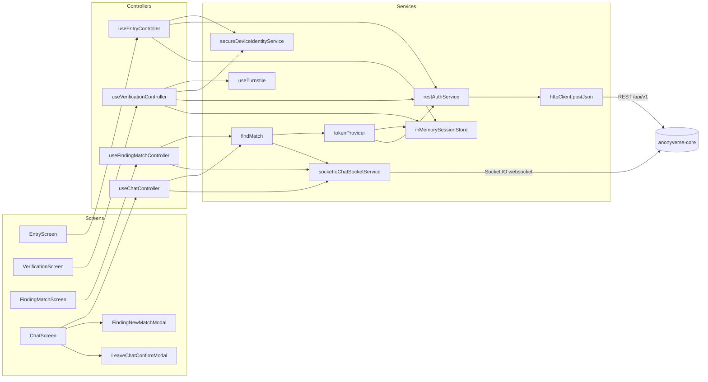

| Piece | File | Responsibility |
|---|---|---|
| `useEntryController` | `screens/entry/` | Decides whether the user is new or returning, calls `get-started`, stores the token |
| `useVerificationController` | `screens/verification/` | Turnstile → `captcha/verify` → stores the token and device id. Allows 2 attempts |
| `useFindingMatchController` | `screens/findingMatch/` | First search. Hands the **live socket** to Chat after a 1.2s "matched" card |
| `useChatController` | `screens/chat/` | Messages, typing, replies, skip, rematching, resuming after a drop, the leave confirmation |
| `findMatch` | `services/chatSocket/findMatch.ts` | Connect, join, wait for a match, and all retry rules. Shared by both controllers above |
| `socketIoChatSocketService` | `services/chatSocket/` | Thin Socket.IO wrapper: events in, emits out, mood mapped for the server (`toBackendMood`: low → `fl`). No retry logic |
| `tokenProvider` | `services/session/tokenProvider.ts` | Returns a fresh access token, refreshing when needed (only one refresh at a time) |
| `inMemorySessionStore` | `services/session/` | Holds the token pair in memory and answers "is it expired?" |
| `restAuthService` | `services/auth/` | `get-started`, `verify`, `refresh` → typed outcomes |
| `httpClient` | `services/api/` | `fetch` wrapper. Refuses non-https URLs in production (`config/env.ts`) |
| `useAppForeground` | `hooks/` | Calls back when the app goes from background to active |

---

## 4. Auth and session

### Getting a session

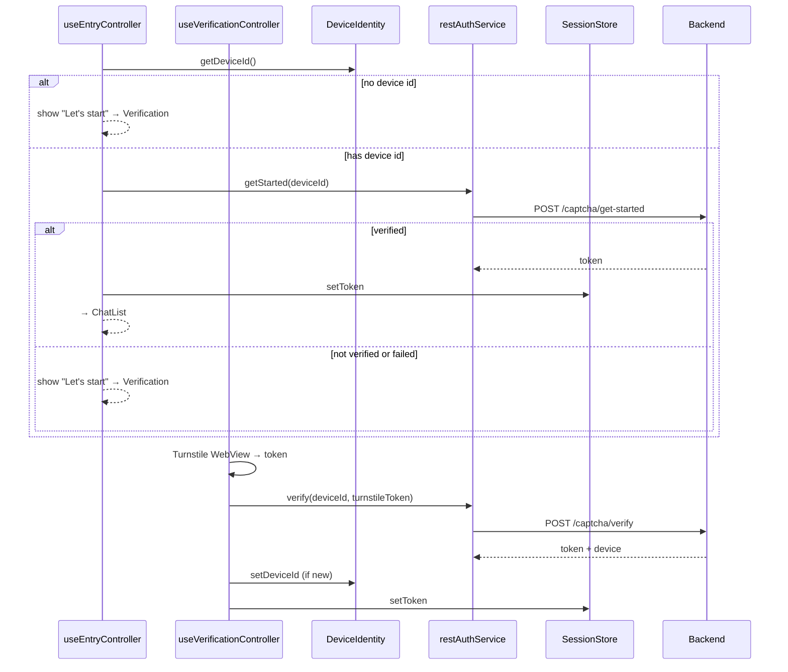

### Keeping it fresh

Tokens: the access token lasts 30 minutes and the refresh token lasts 4 hours. **Every refresh rotates the refresh token.**

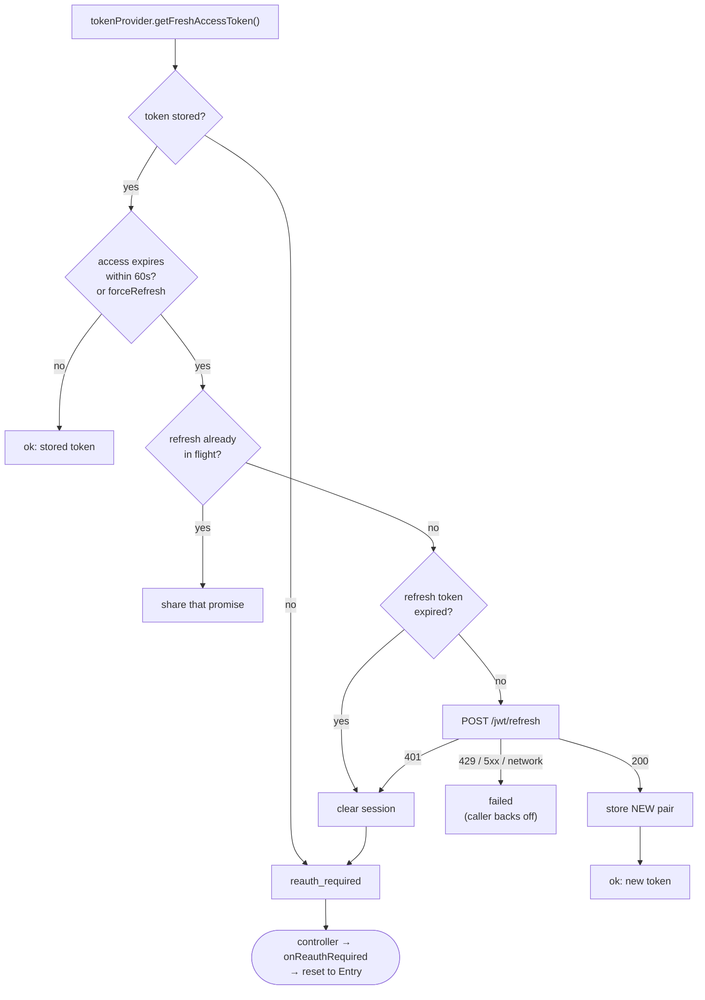

---

## 5. Matchmaking loop (`findMatch`)

This one function handles every "connection went wrong" rule in the contract. Callers stop it by aborting the `AbortSignal` they passed in, which also ends any wait in progress. They close the socket themselves.

It never re-sends `join_chat` while queued: an ok ack holds our place, and `join_chat` is rate limited.

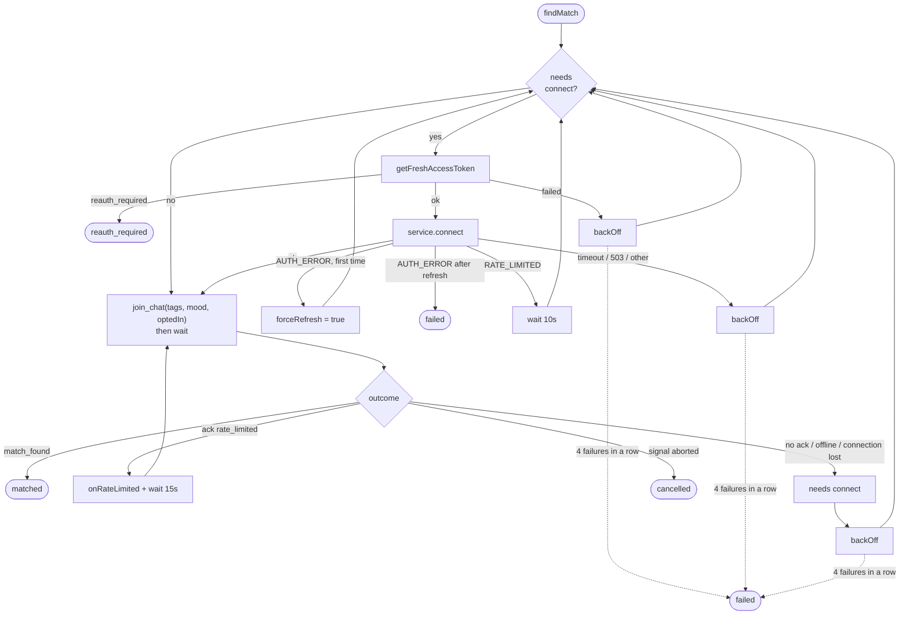

| Constant | Value | Why |
|---|---|---|
| `MAX_FAILED_ATTEMPTS` | 4 in a row | Stops retrying after this. Rate-limit waits don't count. Reset once a join is accepted |
| Backoff | 1s → 2s → 4s (max 8s) | Retry delay for 503s and network errors |
| `CONNECT_RATE_LIMIT_WAIT_MS` | 10s | Refill time of the server's connect bucket |
| `JOIN_RATE_LIMIT_WAIT_MS` | 15s | Refill time of the server's `join_chat` bucket |
| `JOIN_CHAT_TIMEOUT_MS` | 10s | Known server bug: no ack if no tag is allowed |
| `CONNECTION_TIMEOUT_MS` | 10s | Handshake timeout |

---

## 6. Finding Match states

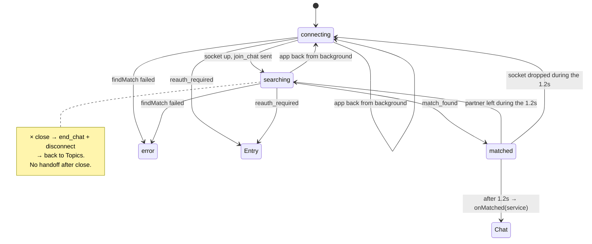

`FindingMatchScreen` shows "Finding a connection" for `connecting` and `searching`, a success card for `matched`, and an error card for `error`.

---

## 7. Chat states

`rematchState` in `useChatController` is `idle` or `rematching`. While `rematching`, `FindingNewMatchModal` covers the chat, and `rematchReason` picks its subtext.

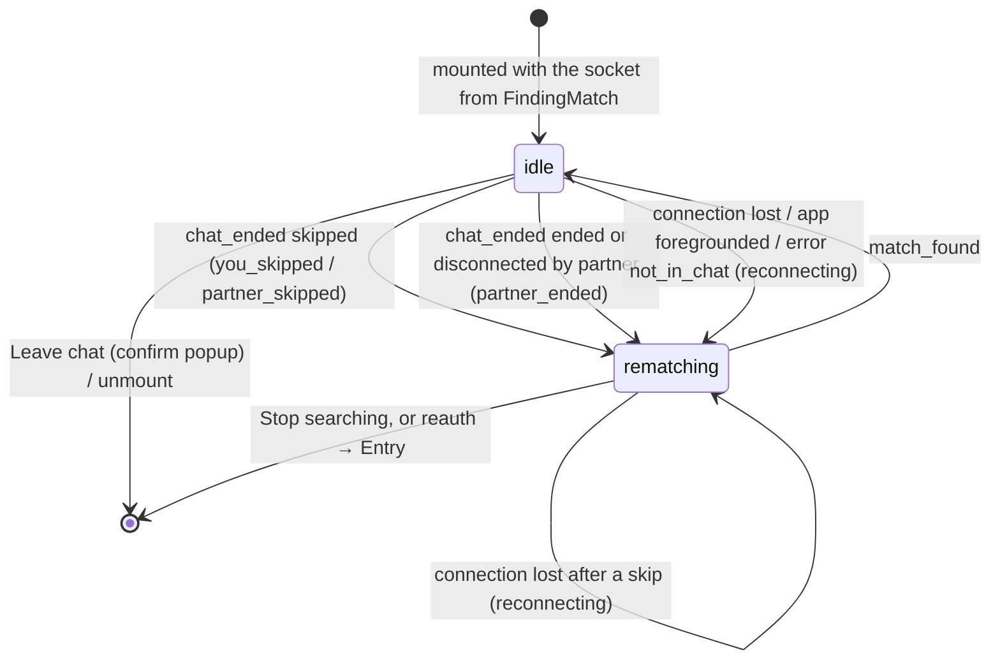

| `rematchReason` | Modal subtext | Who rejoins? |
|---|---|---|
| `you_skipped` / `partner_skipped` | "You skipped the chat…" / "Your partner skipped you…" | **Server** requeues both users. The client never sends `join_chat` here, and `queued` needs no handler |
| `partner_ended` | "Your partner has ended the chat…" | **Client**: `findMatch` on the same socket |
| `reconnecting` | "You were disconnected, finding a new partner" | **Client**: new socket and fresh token, then `findMatch` |

While a client rejoin runs, the modal's status line shows "Matchmaking is busy…" during a rate-limit wait, and switches to the error style ("Couldn't find a new match…", `rematchGaveUp`) once `findMatch` gives up. A connection lost in the background is picked up by the foreground listener instead, so the reconnect isn't killed again.

Any `match_found` resets the thread to "Connected with anonymous partner. Say Hi!", clears the reply, and restarts the 10s skip lock.

---

## 8. Server event → handler

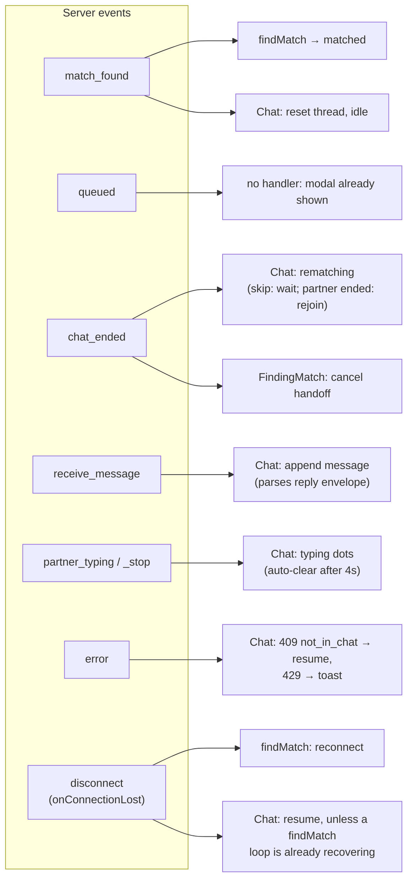

| Client → server | Sent by | When |
|---|---|---|
| `join_chat` | `findMatch` | First search, rejoin after the partner ended, reconnect. **Never after a skip** |
| `send_message` | `handleSend` | Plain text, or the JSON `{text, replyTo}` envelope (falls back to plain text if over 2000 characters) |
| `typing` / `typing_stop` | `setInputValue` | `typing_stop` after 4s idle, on send, or when the input is cleared |
| `skip_chat` | `handleSkip` | After the 10s lock. Client-side limit: 3, then one per 30s |
| `end_chat` | `handleConfirmLeave`, FindingMatch `handleClose` | Followed right away by disconnect |

---

## 9. Debugging cheat sheet

### Symptom → where to look

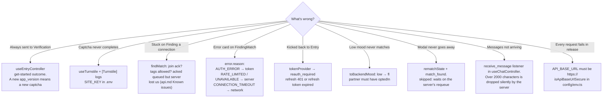

### Log prefixes

| Prefix | Source |
|---|---|
| `[Entry]` | `useEntryController` |
| `[Verification]` / `[Turnstile]` | `useVerificationController` / `useTurnstile` |
| `[FindingMatch]` | `useFindingMatchController` |
| `[Chat]` | `useChatController` |
| `[env]` | `config/env.ts`: missing env values, non-https URL |
| `[DevChat]` | the no-op socket used by the DEV menu's Chat preview |

### PostHog events

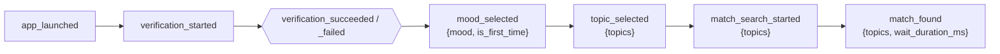

### Dev menu (DEV builds, the floating **DEV** button)

It opens any screen on its own. **Chat** and **Finding New Match modal** are UI previews that use a no-op socket. **Finding Match** connects for real, and sends you back to Entry if there's no session.
